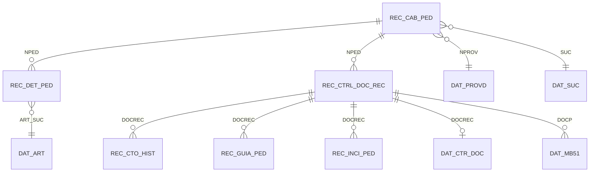
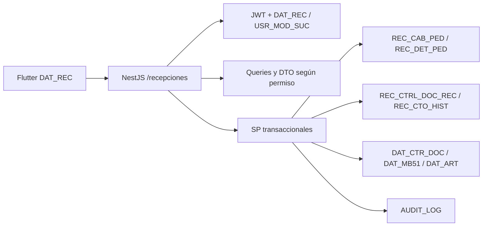
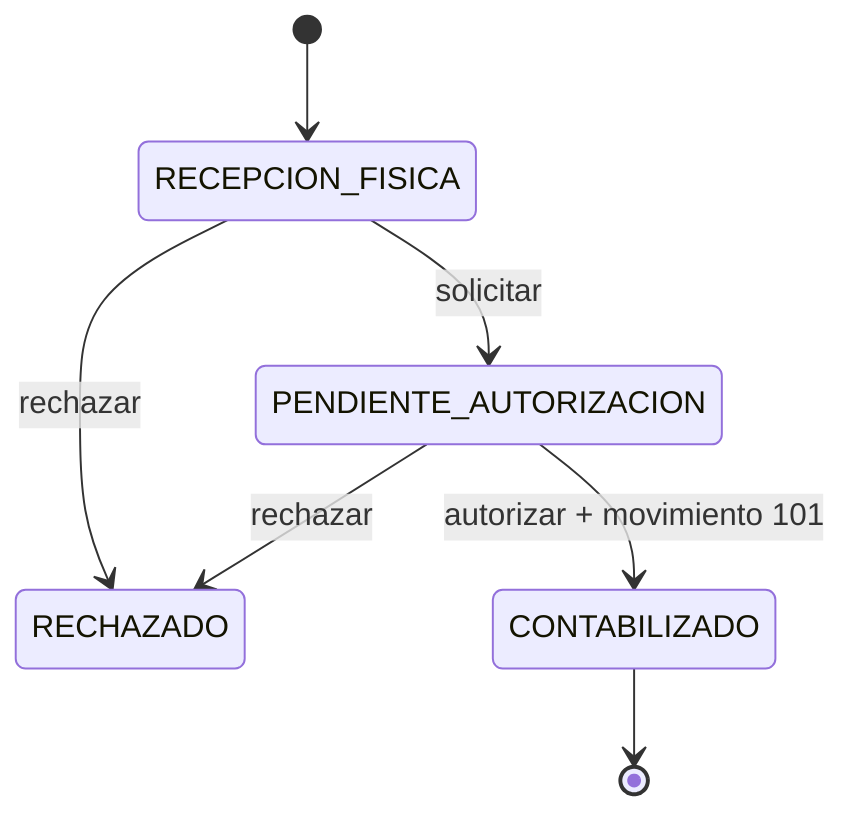

# DAT_REC - Recepción de mercancías

## Diagnóstico

El sistema ya contiene el núcleo de pedidos y recepción legado. `REC_CAB_PED` y `REC_DET_PED` almacenan la O.C.; `REC_CTRL_DOC_REC` y `REC_CTO_HIST` almacenan cada recepción y sus renglones. Los históricos confirman múltiples `DOCREC` por `NPED`. La contabilización existente usa `DAT_CTR_DOC`, movimiento `DAT_CMOV.CMOV=101`, `DAT_MB51` y almacén `002`.

Antes de este cambio no existían API ni pantallas Flutter para `DAT_REC`. Tampoco existían en SQL Server los objetos Access `REC_GUIA_PED` y `REC_INCI_PED`. La recepción legacy contabilizaba directamente, sin estado persistente que separara recepción física y autorización administrativa.

## Matriz Access -> SQL/API

| Objeto Access | Tipo | SQL existente | API/servicio existente antes | Función | Decisión | Justificación |
|---|---|---|---|---|---|---|
| DAT_ART | Tabla | Sí | `datart`, inventarios | Artículo y existencia | Reutilizar | Fuente oficial por sucursal. |
| DAT_ART_SVR | Tabla réplica | No | No | Réplica de catálogo | No crear | `DAT_ART` ya cubre el uso operativo. |
| DAT_PROVD | Tabla | Sí | Catálogos existentes | Proveedor | Reutilizar | Evita `suppliers`. |
| DAT_SUC | Tabla | Sí | Catálogos existentes | Sucursal | Reutilizar | Evita `branches`. |
| REC_CAB_PED | Tabla | Sí | `/sugeridos` | Cabecera O.C. | Reutilizar | Núcleo de pedido. |
| REC_DET_PED | Tabla | Sí | `/sugeridos` | Detalle y acumulado recibido | Reutilizar | `CTDPED`, `CTDREC` determinan pendiente. |
| REC_CTO_HIST | Tabla | Sí | No | Renglones por recepción | Extender | Se agregan vínculo `DOCREC/IDPED`, cantidad aceptada y calidad. |
| REC_CTRL_DOC_REC | Tabla | Sí | No | Cabecera por recepción | Extender | Se agregan estados físico/administrativo y datos documentales. |
| DAT_CTR_DOC | Tabla | Sí | Varios procesos | Control de documento contable | Reutilizar | Idempotencia por `DOC`. |
| DAT_MB51 | Tabla | Sí | `datmb51` | Movimiento de inventario | Reutilizar | Movimiento oficial 101. |
| JRQ_CLAS/JRQ_DEPA/JRQ_SCLA/JRQ_SCLA2/JRQ_SUBD | Catálogos | Sí | JRQ | Clasificación | Reutilizar | Resuelve criterios configurables. |
| JRQ_GUIA | Catálogo | Sí | JRQ | Guía óptica por SCLA2 | Reutilizar como dato maestro | No representa números de embarque. |
| REC_CAB_REC | Consulta Access | No | `/recepciones` | O.C. seleccionada | Reemplazar por query/DTO | No materializar una view temporal. |
| REC_DET_REC_PRE/REC_DET_REC_REC | Consultas Access | No | `/recepciones/:nped` | Pendiente/capturado | Reemplazar por query/DTO | Se calcula desde `CTDPED-CTDREC`. |
| REC_GUIA_PED | Tabla local Access | No | No | Guías de embarque | Crear mínima | Relación 1:N necesaria y ausente. |
| REC_GUIA_PNL_PED | Formulario/consulta | No | Documento DAT_REC | Panel de guías | No crear | DTO del documento cubre el panel. |
| REC_INCI_PED | Tabla local Access | No | No | Diferencias | Crear mínima | Trazabilidad 1:N necesaria y ausente. |
| REC_TMP_SUG_PED | Temporal Access | No | `/sugeridos/calculo` | Cálculo temporal | No crear | Ya fue reemplazada por SP/CTE paginado. |
| REC_STOCK_MIN | Tabla/formulario local | No | `/sugeridos` | Mínimos | No crear | `DAT_ART.STOCK_MIN` ya es oficial. |

## Matriz requisito -> implementación

| Requisito | Fuente actual | Componente | Regla | Cambio |
|---|---|---|---|---|
| Pedidos pendientes | `REC_CAB_PED/REC_DET_PED` | `GET /recepciones` | Solo `PROCESADO/PARCIAL` con pendiente | Query paginada con alcance DAT_REC. |
| Ocultar costos en sucursal | Roles/JWT | Proyecciones API | No basta ocultar columnas | Campos financieros se omiten del DTO no autorizado. |
| Recepción física | `REC_CTRL_DOC_REC/REC_CTO_HIST` | `POST /recepciones/:nped` | No afecta inventario | SP transaccional crea estado `RECEPCION_FISICA`. |
| Validación de sucursal | `REC_CTRL_DOC_REC` | Automática al crear por Encargado | No afecta inventario | Transiciona a `VALIDADO` y queda para revisión de Inventarios. |
| Parcial/total/múltiple | `CTDPED/CTDREC` | SP recepción/autorización | Pendiente = pedido - acumulado | Nuevo `DOCREC` por evento; total valida cobertura exacta. |
| Diferencias | Brecha SQL | `REC_INCI_PED` | Auto y manual | Registra faltante, sobrante, no solicitado, daño, calidad y otros. |
| Calidad | Jerarquía `DAT_ART/JRQ_*` | `REC_CALIDAD_CRITERIO` + JSON de resultado | Configurable, no hardcode | Catálogo mínimo y resultado por renglón. |
| Factura/nota | `REC_CTRL_DOC_REC` | DTO financiero | Restringido a Inventarios | Columnas aditivas en cabecera. |
| Guías | Brecha SQL | `REC_GUIA_PED` | Varias por recepción | Tabla hija mínima. |
| Solicitud de autorización | Estado recepción | Acción API/SP | Física y administrativa separadas | `RECEPCION_FISICA -> PENDIENTE_AUTORIZACION`. |
| Contabilización | `DAT_CTR_DOC/DAT_MB51/DAT_ART` | `sp_rec_recepcion_autorizar` | Idempotente y serializada | Movimiento 101 únicamente para cantidades físicas mayores que cero, almacén 002 y actualización de existencia en una transacción. Los renglones en cero permanecen visibles en el detalle contabilizado. |
| Rechazo | Estado recepción | Acción API/SP | Sin movimiento | Estado `RECHAZADO`. |
| Auditoría | `AUDIT_LOG` | SPs | Usuario/fecha/entidad | Reutiliza infraestructura central. |
| Recepción masiva | XLSX + API | Flutter + validar/confirmar | Validar, previsualizar, confirmar | Errores por fila y una sola transacción de confirmación. |
| Indicadores | Tablas de recepción | `GET /recepciones/indicadores` | Alcance por sucursal | Cumplimiento, exactitud, incidencias y tiempo promedio. |

## Objetos y contratos

### Tablas reutilizadas

`REC_CAB_PED`, `REC_DET_PED`, `REC_CTRL_DOC_REC`, `REC_CTO_HIST`, `DAT_ART`, `DAT_PROVD`, `DAT_SUC`, `DAT_CTR_DOC`, `DAT_MB51`, `DAT_CMOV`, `AUDIT_LOG`, `USR_MOD_SUC`, `USUARIO`, `ROL` y catálogos `JRQ_*`.

La captura previa del Encargado de sucursal usa `REC_BORRADOR_REC` y `REC_BORRADOR_REC_DET`; no representa una recepción física y se elimina al generar `REC_CTRL_DOC_REC`.

### Tablas extendidas

- `REC_CTRL_DOC_REC`: estado, tipo de recepción, usuarios/fechas física y administrativa, documento comercial, observaciones y almacén.
- `REC_CTO_HIST`: vínculos a recepción/pedido, cantidades solicitada/aceptada, calidad, caducidad y observaciones.

### Tablas nuevas indispensables

- `REC_GUIA_PED`: números de guía por `DOCREC`.
- `REC_INCI_PED`: diferencias e incidencias por `DOCREC`.
- `REC_CALIDAD_CRITERIO`: configuración jerárquica de validaciones. No se cargan reglas de producto hardcodeadas.

### SP

- `sp_rec_recepcion_fisica`
- `sp_rec_recepcion_solicitar`
- `sp_rec_recepcion_autorizar`
- `sp_rec_recepcion_rechazar`

Todos usan transacción; las acciones críticas obtienen `sp_getapplock`. La autorización consulta estado bajo lock y reutiliza `DAT_CTR_DOC.DOC`/`DAT_MB51.IDPD` como barreras idempotentes.

### Endpoints

- `GET /recepciones`, `GET /recepciones/:nped`
- `POST /recepciones/:nped`
- `POST /recepciones/:nped/masiva/validar|confirmar`
- `GET /recepciones/documentos/:docrec`
- `POST /recepciones/documentos/:docrec/solicitar-autorizacion|autorizar|rechazar`
- `GET /recepciones/historial|indicadores`
- `GET /recepciones/catalogos/sucursales|calidad/:art`

## Diagramas

## Pruebas y aceptación

Casos obligatorios: total, parcial, múltiples eventos, faltante, sobrante, no solicitado, documento, calidad, rechazo, autorización, movimiento 101, reintento idempotente, concurrencia por O.C./DOCREC, alcance de sucursal, ocultamiento financiero en API, varias guías, auditoría, carga masiva con error por fila e indicadores.

## Temporales eliminadas o reemplazadas

No se crea `REC_TMP_SUG_PED`, `REC_STOCK_MIN`, `REC_CAB_REC`, `REC_DET_REC_PRE`, `REC_DET_REC_REC` ni paneles materializados. Se reemplazan por queries, DTOs y cálculo directo.

## Riesgos y pendientes

- Las filas históricas de `REC_CTO_HIST` no contienen `DOCREC/IDPED` explícitos; no se ejecuta una actualización masiva riesgosa. Los documentos nuevos sí quedan relacionados de forma determinista.
- La fecha compromiso de proveedor no existe en el esquema auditado; queda pendiente del módulo de proveedores.
- `REC_CALIDAD_CRITERIO` inicia sin reglas para evitar hardcode; Inventarios debe parametrizar criterios antes de exigirlos por clasificación.
- El flujo Access puede seguir insertando recepción legacy. Las columnas nuevas tienen defaults compatibles y no se cambian PK ni tipos existentes.
